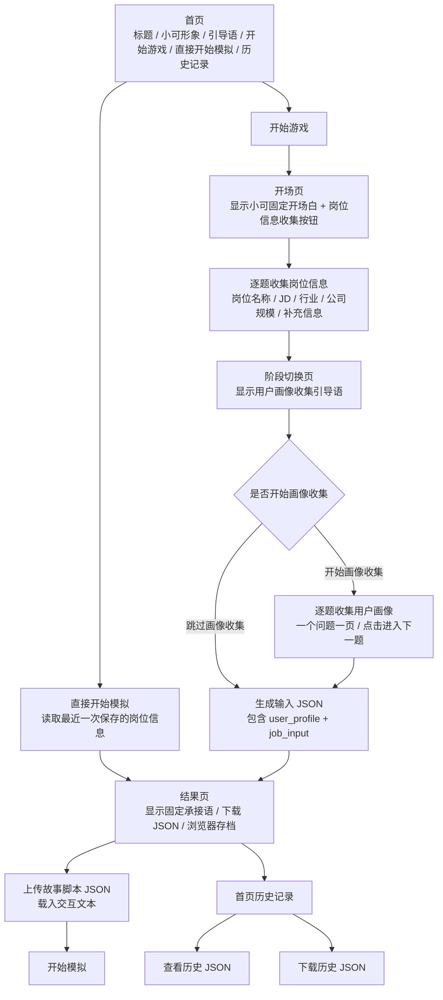

# HTML Flow

## Notes

- 首页只负责进入流程和查看历史记录。
- 首页现在只保留“开始游戏”一个入口。
- 首页现在包含两个入口：开始游戏、直接开始模拟。
- 直接开始模拟会优先读取最近一次保存的岗位信息和画像，再进入结果页继续上传故事脚本。
- 岗位信息收集和画像收集都采用“一题一页”的固定节奏，顺序是先岗位、后画像。
- 岗位信息结束后有一个明确的阶段切换页，用来提示用户接下来进入画像收集。
- 结果页先生成输入 JSON，再提供故事脚本上传入口，上传后直接进入模拟。
- 历史记录中的每一条岗位信息都可以查看、下载或删除。
- 下一步链路应为：
  `输入 JSON -> 小可生成故事脚本 JSON -> 模拟器读取故事脚本 JSON`
